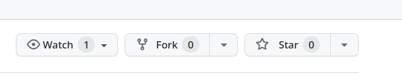
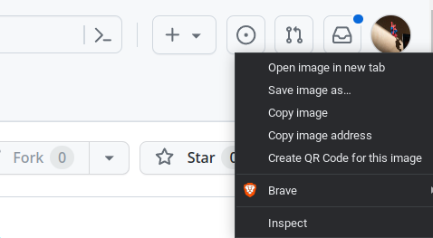
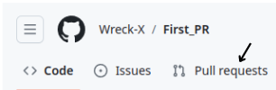
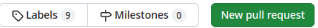

# Welcome to Hacktoberfest 2023!

Begin your Open Source Journey as a contributor by learning to make Pull Requests to a repository. 

## Make your First PR!

1. **Fork this repository** to your account by clicking the Fork button on this repo.

   

2. You now have this repo in your GitHub account. You must be able to see it at `github.com/your-github-username/hacktoberfest-2023`. You can clone the repository.

3. Go ahead and **clone this repository** from your account to your PC. Make sure you have Git installed on your PC. Use the command `git clone https://github.com/<your-github-username>/hacktoberfest-2023` to clone the repository.

4. Open the cloned directory using your system's file manager. You must see a folder called **contributions**. Go inside the folder using the commmand ```cd contributions```. Inside this folder, you must create an HTML file named ```<name>.html``` where you replace ***name** with your name. Copy the HTML code shown below and paste it in the file with an **image link** which is possibly your GitHub profile picture and add your name and message in the respective places.

   ```
   <div class="card">
       
       <div>
           <p class="name">NAME : <b class="name1" style="color: #d2b863">Your_Name</b></p>
           <p class="message">MESSAGE : <b class="message1" style="color: #d2b863">My First PR</b></p>
       </div>
   </div>
   ```

   - Login to your GitHub account and click on the profile icon which appears at the leftmost side of the page.
   - Then right-click on the big avatar which appears at the left side of the screen.
   - Click Copy Image Address and replace **your_github_profile_link** with the link.

   

5. After doing all these, save the file and close the editor.

6. Now commit your changes by following the below steps:

   - Open the terminal/command prompt inside the cloned folder.
   - Run `git add .` to stage the file for committing.
   - Let's commit! Run `git commit -m "Your commit message"`. Get creative with your commit message. You can follow the below format:
     - "[your name]: Add me as a contributor"
     - For instance: "[Hemanth]: Add me as a contributor"
   - Now let's get these changes to your GitHub repo. Run `git push origin main`.

7. You are almost done! Now head over to the original repository from which you forked and click on **Pull Requests**.

   

8. From here, I'll leave you on your own. Make a stunning PR using this flashy green button.

   

9. Google will be your best friend in case you get stuck at any point from now. Now go ahead and make your first cool PR! Style this appropriately.


[Leaderboard](http://51.20.142.245:8000/)